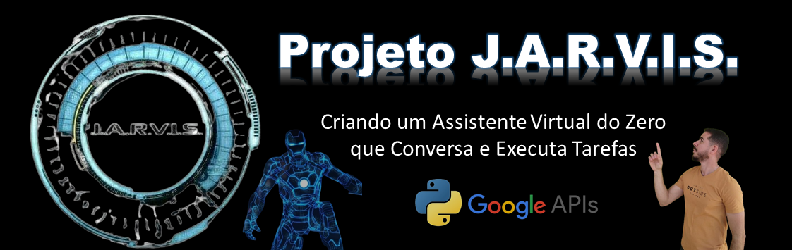

# 🛰️ J.A.R.V.I.S. – Virtual Assistant in Python  
> A fully voice-controlled intelligent assistant built in Python, developed as part of the **CodeVerse Python 2025** project.



---

## 📖 About the Project

**J.A.R.V.I.S.** is a virtual assistant inspired by the Iron Man universe, designed to deliver a dynamic, responsive, and integrated experience.  
It combines **speech recognition**, **text-to-speech**, **Google Gemini AI**, **weather API integration**, **contextual memory**, local automation, and a clean Tkinter graphical interface.

Perfect for learning Python, building automation routines, and showcasing a strong portfolio project.

---

# 🚀 Key Features

## 🎤 Smart Wake Word  
Activated by the word **“Jarvis”**, responding with variations like:

- “Yes, sir?”
- “At your service.”
- “I’m here.”
- “Ready to assist.”

---

## 🎙️ Speech Recognition + Natural Responses  
- User speaks → Jarvis listens and executes.  
- Jarvis responds using **pyttsx3** with synthesized voice.

---

## 🧠 Intelligent Contextual Memory  
- Stores the **last 20 interactions**  
- Provides conversation summaries on request  
- Supports private mode  
- Integrated note-taking system  

Commands:
activate private mode
deactivate private mode
what did we talk about today?
register note

---

## 📝 Note-Taking System  
Command:  
note
Jarvis asks what to save and records everything into `notas_jarvis.txt`.

---

## 🌤️ Weather & Forecast (OpenWeather)  
Supports:

- Current temperature for any city  
- Next-day forecast  

Examples:
what's the temperature in New York?
what's the forecast for tomorrow in London?

---

## 🤖 Intelligent Search with Google Gemini  
Jarvis uses the **Google Gemini API** to answer general questions with:

- Up to 25 words  
- A polite, concise “Jarvis-style” tone  

Examples:
search black holes
ask how a star works

---

## 🎵 Playlist Automation  
Command:
play playlist

Jarvis will ask:
Then opens the corresponding playlist on YouTube.

---

## 🖥️ Local Program Automation (Windows)
Available commands:

- Open browser  
- Open calculator  
- Open Word  
- Open Excel  
- Open VS Code  

---

## 🕒 System Information  
Supported:

- “What time is it?” 
- “What’s today’s date?” 

---

## ⛔ Safe Shutdown  
Commands:
shutdown
close system

Closes the GUI and ends the assistant.

---

# 🖥️ Tkinter Graphical Interface

- Clean and compact design  
- Animated central arc that changes color depending on:
  - Listening  
  - Speaking  
  - Idle  

---

# 🧩 Project Structure
```
Project-JARVIS/
│
├── jarvis.py # Main application
├── notas_jarvis.txt # Note storage file
├── Jarvis_banner.png # README banner
├── requirements.txt # Python dependencies
└── README.md # Project documentation
```

---

# 🛠️ Technologies Used

| Technology | Purpose |
|-----------|----------|
| **Python 3.12+** | Core language |
| **Tkinter** | Graphical interface |
| **SpeechRecognition** | Speech-to-text |
| **Pyttsx3** | Text-to-speech |
| **Google Gemini API** | AI-powered search |
| **Requests** | HTTP requests |
| **OpenWeather API** | Weather data |
| **Threading** | Background execution |
| **Webbrowser** | Open websites |
| **Deque** | Contextual memory |

---

# 📦 Dependencies (requirements.txt)

```txt
speechrecognition
pyttsx3
google-generativeai
requests
pyaudio
```

🔧 How to Run
1️⃣ Clone the repository
```
git clone https://github.com/Carlos-CGS/Projeto-JARVIS.git
cd Projeto-JARVIS
```

2️⃣ Install dependencies
```
pip install -r requirements.txt
```

3️⃣ Add your API keys

Inside jarvis.py, configure:
```
OPENWEATHER_KEY = "YOUR_OPENWEATHER_KEY"
GEMINI_KEY = "YOUR_GEMINI_KEY"
```

4️⃣ Run the project
```
python jarvis.py
```

---
## 🎥 Live Demo
Watch the assistant running in action:
🔗 https://www.linkedin.com/feed/update/urn:li:activity:7241385354061058048/

---
## 🤝 Contributing
Contributions are welcome!
- Feel free to:
- Open issues
- Submit pull requests
- Suggest enhancements
- Report bugs
- For major changes, please open a discussion first.

## 📜 License
This project is licensed under the MIT License.

## 📬 Contact
- 👤 Carlos Garcia – Full Stack Developer in training
- 🔗 LinkedIn: https://www.linkedin.com/in/carlos-cgs/
- 📦 GitHub: https://github.com/Carlos-CGS
