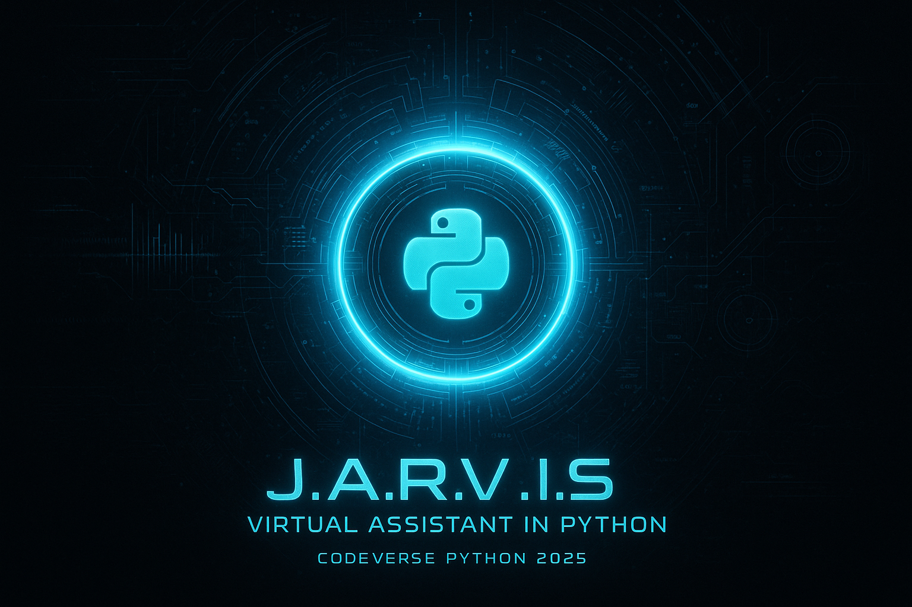

# 🛰️ J.A.R.V.I.S. – Virtual Assistant in Python  
> Um assistente virtual inteligente, totalmente controlado por voz, desenvolvido em Python como parte do projeto **CodeVersePython2025**.


---

## 📖 Sobre o Projeto
O **J.A.R.V.I.S.** é um assistente virtual inspirado no universo do Homem de Ferro, projetado para entregar uma experiência dinâmica, responsiva e integrada.  
Ele combina **reconhecimento de voz**, **síntese de voz**, **API de IA (Google Gemini)**, **previsão do tempo**, **memória contextual**, automações locais e uma interface gráfica amigável em Tkinter.

Ideal para estudos, automação pessoal e portfólio profissional.

---

## 🚀 Funcionalidades Principais

### 🎤 Wake Word Inteligente  
Ativado pela palavra **“Jarvis”**, respondendo com variações como:
- “Sim, senhor?”
- “Às ordens.”
- “Estou aqui.”
- “Pronto para ajudar.”

---

### 🎙️ Reconhecimento de Voz + Respostas Naturais  
- O usuário fala → o JARVIS entende e executa.  
- O sistema responde via **pyttsx3**.

---

### 🧠 Memória Contextual Inteligente  
- Armazena as **20 últimas interações**.  
- Mostra histórico mediante comando.  
- Sistema de anotações integrado.  
- **Modo privado** impede registro de qualquer informação.

Comandos:
ativar modo privado
desativar modo privado
o que falamos hoje?
registrar nota

---

### 📝 Sistema de Anotações  
Comando:  
Ele pergunta o que salvar e registra em `notas_jarvis.txt`.

---

### 🌤️ Clima e Previsão (OpenWeather)  
- Temperatura atual de qualquer cidade  
- Previsão para o dia seguinte  

Exemplo:
qual a temperatura em São Paulo?
qual a previsão para amanhã no Rio de Janeiro?

---

### 🤖 Pesquisa Inteligente com Google Gemini  
O Jarvis usa a API do Google Gemini para responder a qualquer pergunta no estilo:

- Máximo 25 palavras  
- Tom educado, direto e profissional  

Exemplo:
pesquisar buracos negros
perguntar como funciona uma estrela

---

### 🎵 Playlists Inteligentes  
Comando:
tocar playlist

O Jarvis pergunta:
Deseja a playlist foco, estudo ou treino?
E abre a playlist correspondente no YouTube.

---

### 🖥️ Abertura de Programas no Windows  
Comandos disponíveis:
- Abrir navegador  
- Abrir calculadora  
- Abrir Word  
- Abrir Excel  
- Abrir VS Code  

---

### 🕒 Informações do Sistema  
- “Que horas são?”  
- “Que dia é hoje?”  

---

### ⛔ Encerramento Seguro  
Comando:
desligar
encerrar

O sistema fecha a interface e encerra o assistente.

---

## 🖥️ Interface Gráfica (Tkinter)

- Janela compacta  
- Visual minimalista  
- Anel animado que muda de cor quando:
  - está falando  
  - está ouvindo  
  - está ocioso  

---

## 🧩 Arquitetura do Projeto
```Projeto-JARVIS/
│
├── jarvis.py # Código principal
├── notas_jarvis.txt # Armazenamento das anotações
├── Jarvis_banner.png # Banner do README
├── requirements.txt # Dependências do projeto
└── README.md # Documentação do repositório
```

---

## 🛠️ Tecnologias Utilizadas

| Tecnologia | Função |
|-----------|--------|
| **Python 3.12+** | Linguagem principal |
| **Tkinter** | Interface gráfica |
| **SpeechRecognition** | Reconhece fala |
| **Pyttsx3** | Produz fala |
| **Google Gemini API** | IA para pesquisas |
| **Requests** | Consumo de APIs |
| **OpenWeather API** | Clima e previsão |
| **Threading** | Execução paralela |
| **Webbrowser** | Abertura de links |
| **Deque** | Memória contextual |

---

## 📦 Dependências (requirements.txt)

```txt
speechrecognition
pyttsx3
google-generativeai
requests
pyaudio
```

---
## 🔧 Como Executar
1️⃣ Clonar o repositório
```
git clone https://github.com/Carlos-CGS/Projeto-JARVIS.git
cd Projeto-JARVIS
```
2️⃣ Instalar dependências
```
pip install -r requirements.txt
```

3️⃣ Adicionar suas chaves de API

Abra jarvis.py e preencha:
```
OPENWEATHER_KEY = "SUA_CHAVE_OPENWEATHER"
GEMINI_KEY = "SUA_CHAVE_GEMINI"
```

4️⃣ Executar
```
python jarvis.py
```

---
## 🎥 Demonstração em Vídeo

Veja o JARVIS funcionando:
🔗 https://www.linkedin.com/feed/update/urn:li:activity:7241385354061058048/

---
## 🤝 Contribuições

Contribuições são bem-vindas!
Para mudanças maiores, abra uma issue antes para alinharmos as melhorias.

---
## 📜 Licença

Projeto disponibilizado sob a MIT License.

--- 
## 📬 Contato

👤 Carlos Garcia – Desenvolvedor Full Stack em formação/

🔗 LinkedIn: https://www.linkedin.com/in/carlos-cgs/

📦 GitHub: https://github.com/Carlos-CGS/

